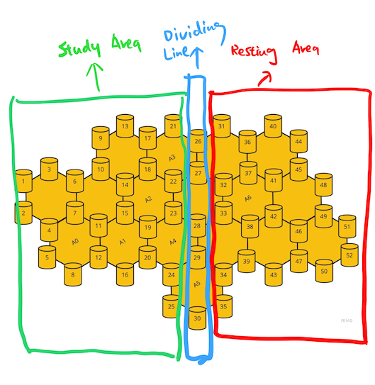
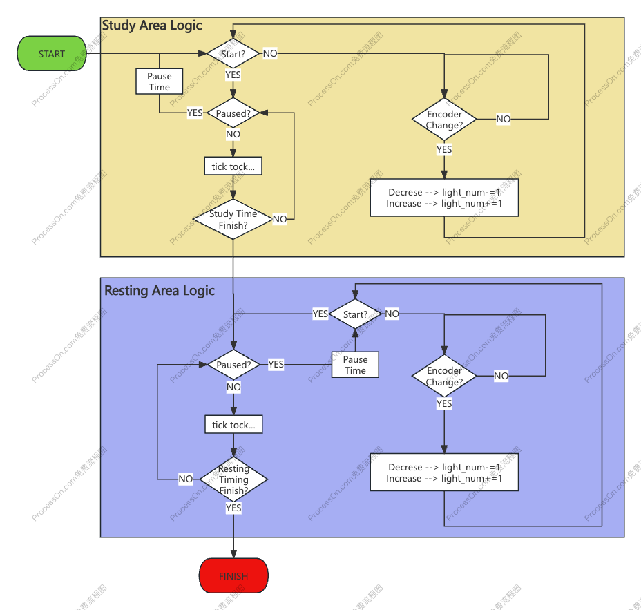
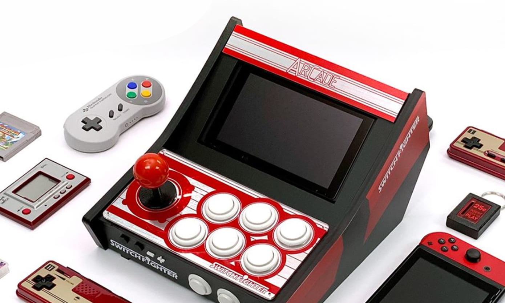
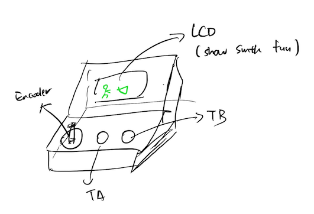

# CASA0014_Connected-Environment_Chrono_Lumina: Working Amigo

  

## Table of Contents

1. [Working Amigo](#working-amigo)
2. [Building Process](#building-process)
3. [Reflection](#reflection)

## Working Amigo💻
The Working Amigo is a Pomodoro Technique-inspired tool that utilizes subtle lighting cues to enhance focus and productivity, while also serving as a non-verbal communication device to indicate work and rest periods to users and their surroundings.

## Background
#### The Great Illusion: Busyness as Productivity
For knowledge workers in today's hectic work setting, the challenge of deeply focusing on tasks, a concept Dr. Cal Newport discusses in his book "Deep Work," is all too common. This difficulty arises because it's often unclear how to measure the value of each person's contributions to their job. As a result, there's a tendency to follow the path of least effort, which might make us appear busy but doesn't always lead to productivity or meaningful results.

#### The Time Mastery: The Pomodoro Technique
The Pomodoro Technique is a time management ally for knowledge workers, transforming productivity with 25-minute focused bursts followed by short breaks.

#### The Art of Subtlety: Calm Technology
Calm Technology is the quiet revolution in the digital world, advocating for a minimalist and intuitive interaction with our tools. It's about technology that serves us without constant demands for attention.

**Reference:**

[1] "*Deep Work*" - [DigeTekS News](https://www.digeteks.com/files/2024/04/DigeTekS_NEWS_PC_AUTO_May2024_Rev1_Pages.pdf)  
[2] Pomodoro Technique - [Wikipedia](https://en.wikipedia.org/wiki/Pomodoro_Technique)  
[3] "*Calm Technology*" - [Google Books](https://books.google.co.uk/books?hl=zh-CN&lr=&id=iYkKAgAAQBAJ&oi=fnd&pg=PT10&dq=IoT+Design:)

## Building Process

### Board & Sensor

- **TTP223B Digital Touch Sensor Specifications x 2**
  - Operating Voltage: 2.0V to 5.5V
  - Operating Current: Typical 1.5µA (max 3.0µA) in low power mode at VDD=3V
  - Output Mode: Configurable as high or low level, momentary or latching, depending on onboard jumper settings
  - Response Time: Maximum 220ms in low power mode at VDD=3V
  - Interface: 2.54mm pin spacing for easy breadboard connections  
  The TTP223B module is based on the capacitive touch sensing IC TTP223B, offering a wear-free touch input solution to replace traditional mechanical buttons. [(handsontec.com)](https://www.handsontec.com)

- **Arduino MKR WiFi 1010 Specifications**
  - Microcontroller: Microchip SAMD21 Cortex-M0+ 32-bit ARM MCU
  - Operating Voltage: 3.3V
  - Digital I/O Pins: 8 (12 with PWM)
  - Analog Input Pins: 7
  - Wi-Fi Module: u-blox NINA-W10 (802.11 b/g/n)
  - Bluetooth: Bluetooth® and BLE v4.2
  - Flash Memory: 256 KB
  - SRAM: 32 KB  
  [Arduino MKR WiFi 1010 Documentation](https://docs.arduino.cc/hardware/mkr-wifi-1010)

- **EC11B15244 Rotary Encoder Specifications**
  - Type: Incremental rotary encoder
  - Resolution: 15 pulses per revolution
  - Detents: 30 detents
  - Switch: Integrated push switch
  - Current Rating: 10mA
  - Rotational Life: 15,000 cycles  
  This encoder is compact and reliable, suitable for precise control applications.  
  [Rotary Encoder Link](https://example.com/rotary-encoder)

### System Design

  

  

### 3D Modeling

Some cool design I probably can learn from:

  

**Working Amigo** 3D model sketch:

  

## Reflection

### Development Challenges
... (Discussion of any key additions, changes, and challenges faced during the development of the system.)

### Observations on Sensing Limitations
... (Insights on the limitations of what the device is sensing and how these limitations impact the data.)

### Unintended Consequences
... (Reflection on any unintended consequences of the device and its deployment.)

### Negative Consequences
... (Analysis of the potential negative consequences of the devices being prototyped.)
