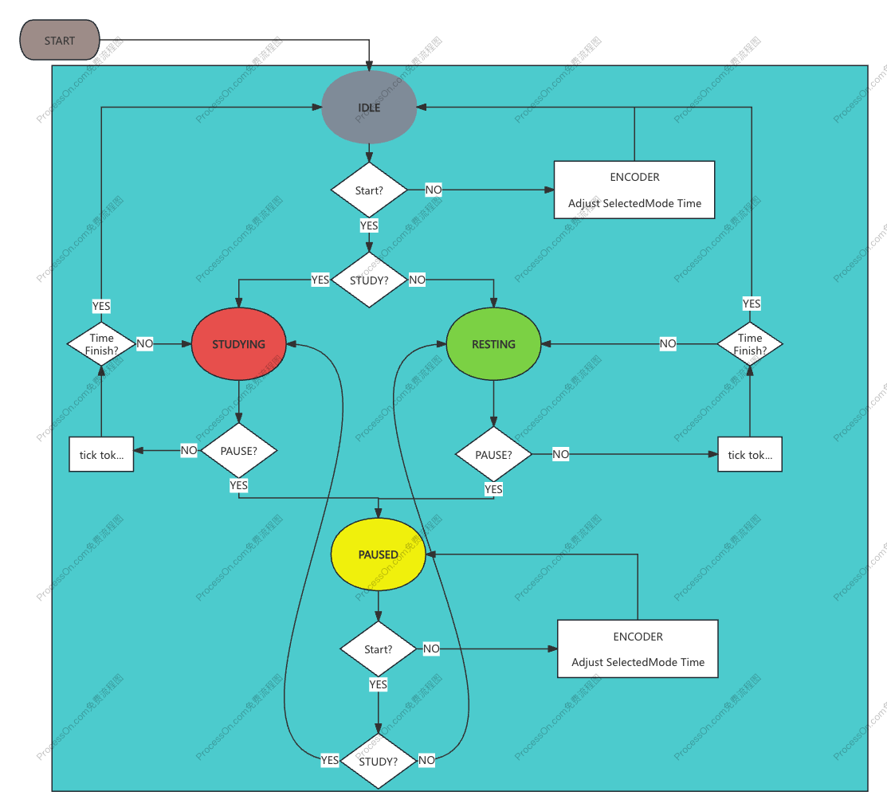

# CASA0014_Connected-Environment_Chrono_Lumina: Working Amigo
<p align="center">
  
</p>


## Table of Contents

1. [Working Amigo](#working-amigo)
2. [Background](#background)
3. [Board & Sensor](#board--sensor)
4. [System Design](#system-design)
5. [3D Modeling](#3d-modeling)
6. [Building Process](#building-process)
7. [Reflection](#reflection)

## Working Amigo💻
The Working Amigo is a Pomodoro Technique-inspired tool that utilizes subtle lighting cues to enhance focus and productivity, while also serving as a non-verbal communication device to indicate work and rest periods to users and their surroundings.

## Background
#### The Great Illusion: Busyness as Productivity
For knowledge workers in today's hectic work setting, the challenge of deeply focusing on tasks, a concept Dr. Cal Newport discusses in his book "Deep Work," is all too common. This difficulty arises because it's often unclear how to measure the value of each person's contributions to their job. As a result, there's a tendency to follow the path of least effort, which might make us appear busy but doesn't always lead to productivity or meaningful results.

#### The Time Mastery: The Pomodoro Technique
The Pomodoro Technique is a time management ally for knowledge workers, transforming productivity with 25-minute focused bursts followed by short breaks.

#### The Art of Subtlety: Calm Technology
Calm Technology is the quiet revolution in the digital world, advocating for a minimalist and intuitive interaction with our tools. It's about technology that serves us without constant demands for attention.

**Reference:**

[1] "*Deep Work*" - [DigeTekS News](https://www.digeteks.com/files/2024/04/DigeTekS_NEWS_PC_AUTO_May2024_Rev1_Pages.pdf)  
[2] Pomodoro Technique - [Wikipedia](https://en.wikipedia.org/wiki/Pomodoro_Technique)  
[3] "*Calm Technology*" - [Google Books](https://books.google.co.uk/books?hl=zh-CN&lr=&id=iYkKAgAAQBAJ&oi=fnd&pg=PT10&dq=IoT+Design:)


## Board & Sensor

- **TTP223B Digital Touch Sensor Specifications x 2**
  - Operating Voltage: 2.0V to 5.5V
  - Operating Current: Typical 1.5µA (max 3.0µA) in low power mode at VDD=3V
  - Output Mode: Configurable as high or low level, momentary or latching, depending on onboard jumper settings
  - Response Time: Maximum 220ms in low power mode at VDD=3V
  - Interface: 2.54mm pin spacing for easy breadboard connections  
  The TTP223B module is based on the capacitive touch sensing IC TTP223B, offering a wear-free touch input solution to replace traditional mechanical buttons. [(handsontec.com)](https://www.handsontec.com)

- **Arduino MKR WiFi 1010 Specifications**
  - Microcontroller: Microchip SAMD21 Cortex-M0+ 32-bit ARM MCU
  - Operating Voltage: 3.3V
  - Digital I/O Pins: 8 (12 with PWM)
  - Analog Input Pins: 7
  - Wi-Fi Module: u-blox NINA-W10 (802.11 b/g/n)
  - Bluetooth: Bluetooth® and BLE v4.2
  - Flash Memory: 256 KB
  - SRAM: 32 KB  
  [Arduino MKR WiFi 1010 Documentation](https://docs.arduino.cc/hardware/mkr-wifi-1010)

- **EC11B15244 Rotary Encoder Specifications**
  - Type: Incremental rotary encoder
  - Resolution: 15 pulses per revolution
  - Detents: 30 detents
  - Switch: Integrated push switch
  - Current Rating: 10mA
  - Rotational Life: 15,000 cycles  
  This encoder is compact and reliable, suitable for precise control applications.  
  [Rotary Encoder Link](https://example.com/rotary-encoder)


## System Design
The system allows users to switch between work and rest modes with a simple touch of a sensor. A rotary encoder enables you to set the duration for study or rest sessions and even pause or restart them as needed, making it a practical tool for structuring your day with precision. Beyond just helping users structure their time into productive blocks, the system’s lights communicate subtle yet vital information to
the surrounding environment. 

<p align="center">
  
</p>


The program implements a timer system with study and rest modes, allowing users to select modes, adjust durations, and toggle states via a rotary encoder and touch sensors. It provides real-time feedback through NeoPixel LEDs, reflecting the current mode and timer status using color changes. The system manages time adjustments and state transitions with precise control, while WiFi and MQTT connectivity enable dynamic light updates by publishing to a specified topic. Its modular design separates input handling, timer logic, and communication for scalability and reliability.


<p align="center">
  
</p>


## Building Process
<p align="center">
  
</p>


### 1. Hardware Setup

**MQTT Setup**
```cpp
void startWifi() {
    Serial.print("Connecting to WiFi");
    WiFi.begin(ssid, password);
    
    while (WiFi.status() != WL_CONNECTED) {
        delay(500);
        Serial.print(".");
    }
    
    Serial.println("\nWiFi connected");
    Serial.println("IP address: ");
    Serial.println(WiFi.localIP());
}

void reconnectMQTT() {
    while (!client.connected()) {
        Serial.print("Attempting MQTT connection...");
        String clientId = "ArduinoClient-";
        clientId += String(random(0xffff), HEX);
        
        if (client.connect(clientId.c_str(), mqtt_username, mqtt_password)) {
            Serial.println("connected");
        } else {
            Serial.print("failed, rc=");
            Serial.print(client.state());
            Serial.println(" try again in 5 seconds");
            delay(5000);
        }
    }
}
```


### 2. Component Testing
I tested each electronic component in the test files. If you want to make sure your component works well individually before you intergrate them:

- [touch sensors](https://github.com/rorschachwilpeng/casa0014_chrono_lumina/blob/main/src/test/touchSensor_test/touchSensor_test.ino)
- [rotary encoder functions test](https://github.com/rorschachwilpeng/casa0014_chrono_lumina/blob/main/src/test/rotary_encoder_test/rotary_encoder_test.ino)

### 3. System Integration

The system integrates various hardware components, including touch sensors, a rotary encoder, and the ESP8266 microcontroller. Key initialization steps ensure proper setup for each component:

```cpp
void setup() {
    Serial.begin(115200);
    delay(1000);

    // Set input pins
    pinMode(STUDY_TOUCH_SENSOR, INPUT);
    pinMode(REST_TOUCH_SENSOR, INPUT);
    pinMode(CLK_PIN, INPUT_PULLUP);  // Use internal pull-up resistor
    pinMode(DT_PIN, INPUT_PULLUP);   // Use internal pull-up resistor
    pinMode(SW_PIN, INPUT_PULLUP);  // Use internal pull-up resistor

    // WiFi and MQTT settings
    startWifi();
    client.setServer(mqtt_server, mqtt_port);
    client.setBufferSize(512);
    
    Serial.println("Setup complete");
}
```


### 4. Design the system

**4.1.Timer Function:**
- Two timekeeping modes are realized: **Study** and **Rest**
- The default study time is 25 minutes, and the break time is 5 minutes
- The length of time can be adjusted by means of a rotary encoder

  ```cpp
      Timer() {
          study_time = 25 * 60 * 1000;  // Default 25 minutes
          rest_time = 5 * 60 * 1000;    // Default 5 minutes
          lastCLK = digitalRead(CLK_PIN);
          lastDT = digitalRead(DT_PIN);
          study_remaining = study_time;
          rest_remaining = rest_time;
          pausedFromState = IDLE;
          nextState = IDLE;
          currentLightCount = maxLights;
      }
  ```

**4.2. Input Control**
- Two touch sensors are used to select study and rest modes
- Time adjustment is performed using a rotary encoder
- The encoder button is used to start/pause the timing
  ```cpp
  // Touch Sensors
  #define STUDY_TOUCH_SENSOR 4    // Study mode touch sensor
  #define REST_TOUCH_SENSOR 5     // Rest mode touch sensor

  // Rotary Encoder
  #define CLK_PIN 14             // CLK connected to GPIO14
  #define DT_PIN 12              // DT connected to GPIO12
  #define SW_PIN 13              // SW connected to GPIO13
  ```
**4.3. LED Lighting Feedback**
  - Control the LED strip via MQTT protocol
  - Different colors are displayed for different statuses:
    1. Learning Mode: Red
    2. Rest Mode: Green
    3. Paused Status: Yellow
    4. Idle Status: Off
    ```cpp
        void updateLight() {
          switch (currentState) {
              case STUDY:
                  setAllPixels(255, 0, 0, 0);  // Study mode shows red
                  break;
              case REST:
                  setAllPixels(0, 255, 0, 0);  // Rest mode shows green
                  break;
              case PAUSED:
                  setAllPixels(255, 255, 0, 0);  // Paused state shows yellow
                  break;
              case IDLE:
                  setAllPixels(0, 0, 0, 0);    // Idle state turns off all lights
                  break;
          }
      }
      ```
  **4.4. State Management**
- FOUR STATES ARE IMPLEMENTED: STUDY, REST, IDLE, AND PAUSED
- You can switch modes while paused
  ```cpp
  enum TimerState {
      STUDY,      // Study mode
      REST,       // Rest mode
      IDLE,       // Idle state
      PAUSED      // Paused state
  };
  ```

## Reflection

### User Feedback
User feedback highlighted key improvements. While the lighting system kept users focused, many missed break cues, suggesting the need for sound alerts. Red and green lights were intuitive for regular users but confusing for new ones, raising the need for self-explanatory cues. Manual mode switching via touch sensors proved effective, offering users a mental reset and improving usability.

### How IoT Redefines Interaction
This project highlighted IoT's ability to make data interactive and intuitive. Inspired by smart devices, I explored how lighting could communicate work status and support collaboration. The concept of "Calm Technology" stood out, showing how tech can quietly enhance productivity. Beyond personal time management, the project revealed IoT's potential to improve teamwork and streamline processes.


### Potential Negative Impacts
Lights might reveal work patterns, raising privacy concerns, or distract in shared spaces. Unsecured MQTT transmissions also pose security risks. Future improvements include encrypting data, enhancing user control over information sharing, and refining status displays to improve usability and privacy.
