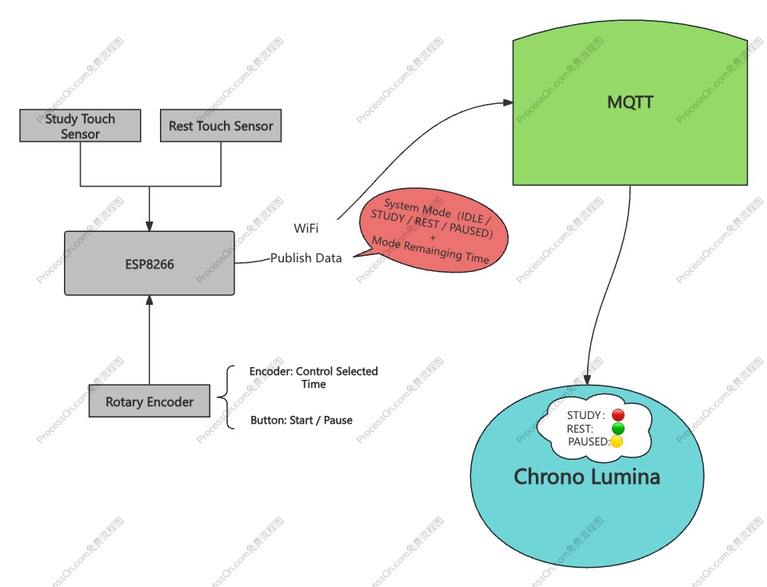
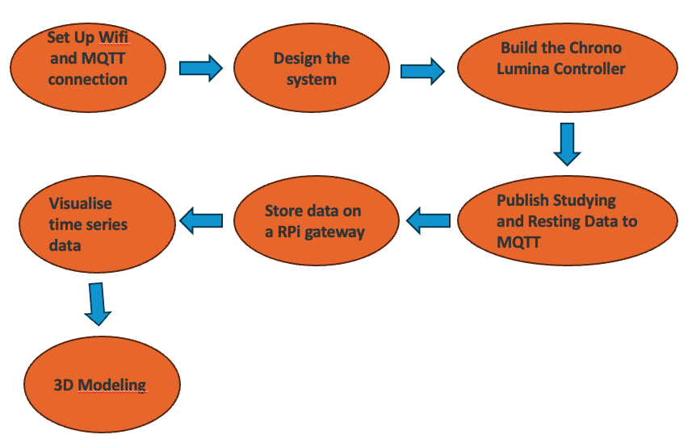

# CASA0014_Connected-Environment_Chrono_Lumina: Working Amigo
<p align="center">
  
</p>


## Table of Contents

1. [Working Amigo](#working-amigo)
2. [Building Process](#building-process)
3. [Reflection](#reflection)

## Working Amigo💻
The Working Amigo is a Pomodoro Technique-inspired tool that utilizes subtle lighting cues to enhance focus and productivity, while also serving as a non-verbal communication device to indicate work and rest periods to users and their surroundings.

## Background
#### The Great Illusion: Busyness as Productivity
For knowledge workers in today's hectic work setting, the challenge of deeply focusing on tasks, a concept Dr. Cal Newport discusses in his book "Deep Work," is all too common. This difficulty arises because it's often unclear how to measure the value of each person's contributions to their job. As a result, there's a tendency to follow the path of least effort, which might make us appear busy but doesn't always lead to productivity or meaningful results.

#### The Time Mastery: The Pomodoro Technique
The Pomodoro Technique is a time management ally for knowledge workers, transforming productivity with 25-minute focused bursts followed by short breaks.

#### The Art of Subtlety: Calm Technology
Calm Technology is the quiet revolution in the digital world, advocating for a minimalist and intuitive interaction with our tools. It's about technology that serves us without constant demands for attention.

**Reference:**

[1] "*Deep Work*" - [DigeTekS News](https://www.digeteks.com/files/2024/04/DigeTekS_NEWS_PC_AUTO_May2024_Rev1_Pages.pdf)  
[2] Pomodoro Technique - [Wikipedia](https://en.wikipedia.org/wiki/Pomodoro_Technique)  
[3] "*Calm Technology*" - [Google Books](https://books.google.co.uk/books?hl=zh-CN&lr=&id=iYkKAgAAQBAJ&oi=fnd&pg=PT10&dq=IoT+Design:)


## Board & Sensor

- **TTP223B Digital Touch Sensor Specifications x 2**
  - Operating Voltage: 2.0V to 5.5V
  - Operating Current: Typical 1.5µA (max 3.0µA) in low power mode at VDD=3V
  - Output Mode: Configurable as high or low level, momentary or latching, depending on onboard jumper settings
  - Response Time: Maximum 220ms in low power mode at VDD=3V
  - Interface: 2.54mm pin spacing for easy breadboard connections  
  The TTP223B module is based on the capacitive touch sensing IC TTP223B, offering a wear-free touch input solution to replace traditional mechanical buttons. [(handsontec.com)](https://www.handsontec.com)

- **Arduino MKR WiFi 1010 Specifications**
  - Microcontroller: Microchip SAMD21 Cortex-M0+ 32-bit ARM MCU
  - Operating Voltage: 3.3V
  - Digital I/O Pins: 8 (12 with PWM)
  - Analog Input Pins: 7
  - Wi-Fi Module: u-blox NINA-W10 (802.11 b/g/n)
  - Bluetooth: Bluetooth® and BLE v4.2
  - Flash Memory: 256 KB
  - SRAM: 32 KB  
  [Arduino MKR WiFi 1010 Documentation](https://docs.arduino.cc/hardware/mkr-wifi-1010)

- **EC11B15244 Rotary Encoder Specifications**
  - Type: Incremental rotary encoder
  - Resolution: 15 pulses per revolution
  - Detents: 30 detents
  - Switch: Integrated push switch
  - Current Rating: 10mA
  - Rotational Life: 15,000 cycles  
  This encoder is compact and reliable, suitable for precise control applications.  
  [Rotary Encoder Link](https://example.com/rotary-encoder)


## System Design

<p align="center">
  
</p>

<p align="center">
  
</p>

<p align="center">
  
</p>

**Reference:**

[1] [Tina](https://github.com/tantoon94)'s Drawing Work

## 3D Modeling

Some cool design I probably can learn from:
<p align="center">
  
</p>

**Working Amigo** 3D model sketch:
<p align="center">
  
</p>


## Building Process
<p align="center">
  
</p>


### 1. Set Up Wifi and MQTT connection with Arduino MKR 1010 WiFi

```C++
void startWifi() {
  if (WiFi.status() == WL_NO_MODULE) {
    Serial.println("WiFi module not found, cannot proceed.");
    while (true);
  }

  if (WiFi.firmwareVersion() < WIFI_FIRMWARE_LATEST_VERSION) {
    Serial.println("Firmware upgrade required.");
  }

  int n = WiFi.scanNetworks();
  if (n == 0) {
    Serial.println("No networks found.");
    return;
  }

  for (int i = 0; i < n; ++i) {
    if (WiFi.SSID(i).equals(ssid)) {
      WiFi.begin(ssid, password);
      while (WiFi.status() != WL_CONNECTED) delay(600);
      Serial.println("Connected to WiFi: " + String(ssid));
      return;
    }
  }
  Serial.println("Failed to connect to any known network.");
}
```

```C++
void reconnectMQTT() {
  if (WiFi.status() != WL_CONNECTED) startWifi();

  while (!client.connected()) {
    String clientId = "LuminaSelector" + String(random(0xffff), HEX);
    if (client.connect(clientId.c_str(), mqtt_username, mqtt_password)) {
      Serial.println("MQTT connected");
    } else {
      Serial.println("MQTT connection failed, retrying in 5 seconds...");
      delay(5000);
    }
  }
}
```

### 2. Design the system
  We illuminate the Chrono Lumina by publish RGB info to the MQTT topics.

  #### 2.1. Dividing area: Chrono Lumina illuminate constantly
  ```cpp
  void controlDividingLine(int lights[], int numLights) {
    for (int i = 0; i < numLights; i++) {
      for (int pixel_id = 0; pixel_id < 12; pixel_id++) {
        sprintf(mqtt_topic_demo, "student/CASA0014/light/%d/pixel/", lights[i]);
        char mqtt_message[100];
        sprintf(mqtt_message, "{\"pixelid\": %d, \"R\": 255, \"G\": 0, \"B\": 0, \"W\": 0}", pixel_id);
        client.publish(mqtt_topic_demo, mqtt_message);
      }
    }
  }
  ```

  #### 2.2. Stduy/Resting areas: Chrono Lumina illuminate with timer
  ```cpp
void controlStudyAreaWithTimer(int lights[], int numLights, bool dynamicEffect, int totalTime) {
    static float angle = 0.0;
    static unsigned long globalStartTime = millis();
    static int currentLightIndex = 0;

    int timeBlock = totalTime / numLights;
    unsigned long elapsedTime = millis() - globalStartTime;

    // Turn off lights if time is up
    if (elapsedTime > (unsigned long)(totalTime * 1000)) {
        for (int i = 0; i < numLights; i++) {
            for (int pixel_id = 0; pixel_id < 12; pixel_id++) {
                sprintf(mqtt_topic_demo, "student/CASA0014/light/%d/pixel/", lights[i]);
                char mqtt_message[100];
                sprintf(mqtt_message, "{\"pixelid\": %d, \"R\": 0, \"G\": 0, \"B\": 0, \"W\": 0}", pixel_id);
                client.publish(mqtt_topic_demo, mqtt_message);
            }
        }
        return;
    }

    // Determine current active light
    currentLightIndex = elapsedTime / (timeBlock * 1000);

    for (int i = 0; i < numLights; i++) {
        for (int pixel_id = 0; pixel_id < 12; pixel_id++) {
            sprintf(mqtt_topic_demo, "student/CASA0014/light/%d/pixel/", lights[i]);

            int R = 0, G = 0, B = 0, W = 0;
            if (i == currentLightIndex) {
                if (dynamicEffect) {
                    angle += 0.1;
                    if (angle > 2 * PI) angle -= 2 * PI;
                    float brightness = minBrightness + (maxBrightness - minBrightness) * (0.5 * (1 + sin(angle)));
                    R = (int)(brightness);
                    G = (int)(brightness * 0.5);
                    B = (int)(brightness * 0.2);
                } else {
                    R = 255;
                    G = 0;
                    B = 0;
                }
            }

            char mqtt_message[100];
            sprintf(mqtt_message, "{\"pixelid\": %d, \"R\": %d, \"G\": %d, \"B\": %d, \"W\": %d}", pixel_id, R, G, B, W);
            client.publish(mqtt_topic_demo, mqtt_message);
        }
    }
}

  ```
  ```controlStudyAreaWithTimer```  is a function designed to manage LED lights in a study or resting area via MQTT communication. Each light represents a time block determined by the total duration divided by the number of lights. During the current active time block, the corresponding light dynamically illuminates if dynamic effects are enabled; otherwise, it remains static. When the total time elapses, all lights turn off. The function ensures seamless control of both dynamic and static lighting effects based on a timer.


### 3. Build the Chrono Lumina Controller
[To be Finished]

### 4. Publish Studying and Resting Data to MQTT
[To be Finished]

### 5. Store data on a RPi gateway
[To be Finished]

### 6. Visualise time series data
[To be Finished]


### 7. 3D Modeling
[To be Finished]


## Reflection

### Development Challenges
... (Discussion of any key additions, changes, and challenges faced during the development of the system.)

### Observations on Sensing Limitations
... (Insights on the limitations of what the device is sensing and how these limitations impact the data.)

### Unintended Consequences
... (Reflection on any unintended consequences of the device and its deployment.)

### Negative Consequences
... (Analysis of the potential negative consequences of the devices being prototyped.)
